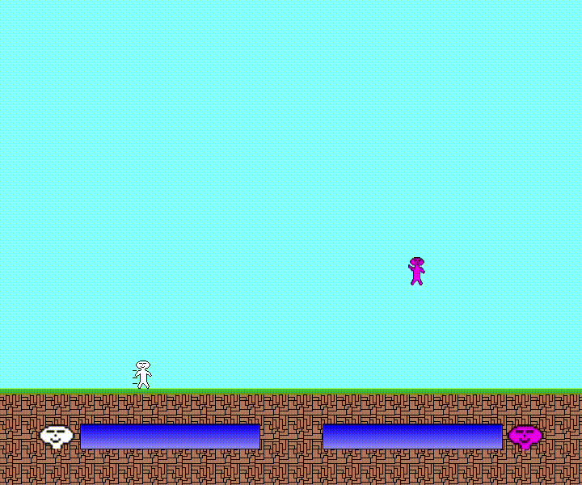

# BackToMe

## Overview

BackToMe is a competitive action shooting game where players shoot bullets that come back to them.

## DEMO

## Game Rules

BackToMe is a competitive action game set on a flat stage where players shoot bullets that come back to them. Players take damage if they are hit by their own bullets or their opponent's bullets.

The game features two modes: STANDARD MODE and SPECIAL MODE. In STANDARD MODE, players jump on the ground, while in SPECIAL MODE, players float in the air. Note that in SPECIAL MODE, players take continuous damage if they are on the ground.

## Controls

Describe how to play the game:

Player 1 Controls
- WASD Keys: Move the player.
- Shift Key: Shoot the bullet.

Player 2 Controls
- Arrow Keys: Move the player.
- Q Key: Shoot the bullet.

General Controls
- W,S Keys: Move the cursor.
- R Key: Retry the game.
- T Key: Move to the title.

## Configuration

The `data/config.txt` specifies the key configuration, player movement capabilities, and bullet performance.

## Installation and Usage

Download [Processing 4.3](https://processing.org/download/) and run this sketch folder in Processing 4.3.

## Author
* Keisuke Morita

## License

This project is licensed under the MIT License - see the [LICENSE.md](./LICENSE.md) file for details.
